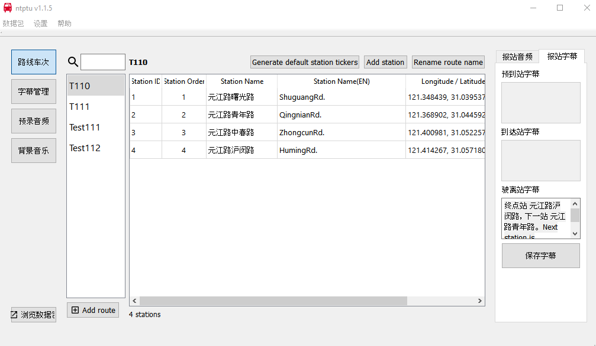
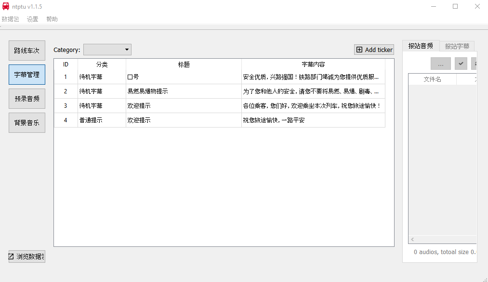

# 20180524 Work notes

* qt5 on Windows
* gtk on Windows
* [msys2](http://www.msys2.org/)
* pacman usage

在 Windows 平台开发 QT 应用程序，还是用 mingw 版比较好，配合 msys2 工具，可以，基本可以做到和 Linux 平台一样的流畅开发体验。使用 msvc 版开发 QT 程序，在处理第三方依赖时，非常麻烦，需要自己手动处理 DLL，也可能是我不知道有好的方法。

## msys2

同步包仓库

    pacman -Syu

Before updating you should synchronize your local package databases with the latest repositories: `pacman -Sy` This command connects to the remote repositories and downloads the package databases.

Install gcc 32 bit package via:  `pacman -S mingw-w64-i686-gcc`

Install pkg-config tool via: `pacman -S mingw-w64-i686-pkg-config`

### General Package Management

* Install package: `pacman -S <package_names|package_groups>`

* Removing packages: `pacman -R <package_names|package_groups>`

* Searching for packages: `pacman -Ss <name_pattern>`

## GTK

Build via: 

    gcc `pkg-config --cflags gtk+-3.0` -o example-0 example-0.c `pkg-config --libs gtk+-3.0`
    
## QT5

    pacman -S mingw-w64-i686-qt5
    pacman -S mingw-w64-i686-qt-creator
    pacman -S mingw-w64-i686-qtwebkit

这是我在 Windows 上开发的一个数据包管理程序：

## Links

[https://developer.gnome.org/gtk3/stable/gtk-getting-started.html](https://developer.gnome.org/gtk3/stable/gtk-getting-started.html)
